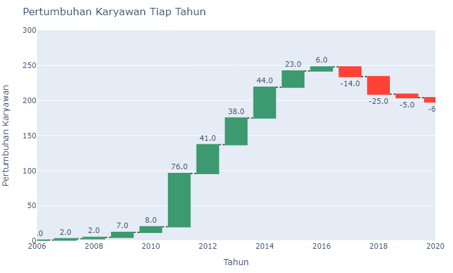

# Improving Employee Retention By Predicting Employee Attrition Using Machine Learning

- Dataset: Sourced from [Rakamin Academy](https://github.com/kevinusmayadhyw/Improving-Employee-Retention-By-Predicting-Employee-Attrition-Using-Machine-Learning/tree/main/dataset).
- Programming Language: Python Version 3.10.11
- Library:
    - pandas version 2.0.1
    - matplotlib version 3.7.1
    - seaborn version 0.12.2
    - numpy version 1.24.3
    - plotly version 5.18.0
    - math
    - imblearn
    - sklearn version 1.2.2
    - shap version 0.42.1

# Overview
Human resources (HR) represent the fundamental assets that require effective management for the company to achieve its business goals efficiently. In this context, we are addressing a challenge related to human resources within the company. Our primary objective is to understand how to retain employees within the current organization, recognizing that turnover incurs increased costs for employee recruitment and training, especially for those who have recently joined. Identifying the key factors contributing to employee dissatisfaction allows the company to proactively address these issues by implementing targeted programs that directly tackle employee concerns.

# EDA (Exploratory Data Analysis)
- Number of Hiring and Resign employee based on year

From the plot, the employee count has shown an increase from 2006 to 2016, with a significant increase observed between 2011 and 2015, suggesting a period of significant expansion for the company. However, a decrease in the number of employees is evident from 2017 to 2020, a decrease that warrants special attention as it may impact the company's overall performance.

- Number of resign and not yet resign based on job

According to the provided plot, the data analyst role has the highest resignation rate at 50%, while roles such as DevOps Engineer, Digital Product Manager, Machine Learning Engineer, Product Design (UX Researcher), Scrum Master, Software Architect, and Software Engineer (iOS) have no resigned employees.

- Number of employees who resigned based on career level, employee performance, and reasons for resigning on the Highest resignation rate (Data Analyst)

According to the Sunburst Charts, resignations from the data analyst role are all of them is Freshgraduate_program, and all of these resignations are attributed to issues related to toxic culture or internal conflict. This underscores the need for the company to address and rectify concerns related to workplace culture to create a more comfortable and conducive working environment.

# Data Preprocessing
|Preprocessing|Finding|Handling|
|-------------|-------|--------|
|Missing Value|SkorKepuasanPegawai, JumlahKeikutsertaanProjek, JumlahKetidakhadiran, IkutProgramLOP, AlasanResign contain missing values.|- 'IkutProgramLOP' will be dropped due to the substantial number of missing values  - 'TanggalResign' is set to be replaced with 'Masih Bekerja'. - 'AlasanResign' is set to be replaced with 'unknown'.  - 'SkorKepuasanPegawai', 'JumlahKeikutsertaanProjek', 'JumlahKeterlambatanSebulanTerakhir', and 'JumlahKetidakhadiran' will be replaced with the median. Given the limited data, this approach is suggested to minimize data loss.|
|Duplicate Data|There is no duplicate value.|-|
|Feathre Engineering|-|1. <b>Umur_pd_Penilaian:</b> This feature will represent the age of the employee at the time of the 'penilaian karyawan'.  2. <b>Months_Hiring_Penilaian (Months_between_Hiring_and_Assessment):</b> This feature will represent the number of Months between the hiring date and the 'penilaian karyawan' date.  3. <b>Tahun_Hiring:</b> This feature is obtained from TanggalHiring  4. <b>Tahun_Resign:</b> This feature is obtained from TanggalResign  5. <b>Resign: </b> This feature is obtained from TanggalResign, if the value is not null so will be filled with 1 and if null will be filled with 0.|
|Feature Encoding|This step is only for categorical columns|- <b>Label Encoding:</b> 'JenisKelamin', 'JenjangKarir', 'PerformancePegawai', and 'TingkatPendidikan'  - <b>One Hot Encoding:</b>  'StatusPernikahan', 'StatusKepegawaian', 'Pekerjaan', 'AsalDaerah', and 'AlasanResign'|
|Splitting Data|-|80% Data Train and 20% Data Test|
|Data Scaling|Varied range of values in each column|MinMaxScaler|
|Handling Imbalance data|- The number of distinct values in the label is significantly different   - Data is to small|Oversampling SMOTE|

# Modeling
- Train

<table border="1" class="dataframe">
  <thead>
    <tr style="text-align: right;">
      <th></th>
      <th>Decision Tree</th>
      <th>Random Forest</th>
      <th>SVM</th>
      <th>K-Nearest Neighbors</th>
      <th>Gradient Boosting Classifier</th>
    </tr>
  </thead>
  <tbody>
    <tr>
      <th>Precision</th>
      <td>1.0</td>
      <td>1.0</td>
      <td>0.891429</td>
      <td>0.857143</td>
      <td>1.0</td>
    </tr>
    <tr>
      <th>Recall</th>
      <td>1.0</td>
      <td>1.0</td>
      <td>1.000000</td>
      <td>0.961538</td>
      <td>1.0</td>
    </tr>
    <tr>
      <th>F1-Score</th>
      <td>1.0</td>
      <td>1.0</td>
      <td>0.942598</td>
      <td>0.906344</td>
      <td>1.0</td>
    </tr>
    <tr>
      <th>Auroc</th>
      <td>1.0</td>
      <td>1.0</td>
      <td>0.939103</td>
      <td>0.900641</td>
      <td>1.0</td>
    </tr>
  </tbody>
</table>

- Test

<table border="1" class="dataframe">
  <thead>
    <tr style="text-align: right;">
      <th></th>
      <th>Decision Tree</th>
      <th>Random Forest</th>
      <th>SVM</th>
      <th>K-Nearest Neighbors</th>
      <th>Gradient Boosting Classifier</th>
    </tr>
  </thead>
  <tbody>
    <tr>
      <th>Precision</th>
      <td>0.736842</td>
      <td>0.750000</td>
      <td>0.592593</td>
      <td>0.521739</td>
      <td>0.764706</td>
    </tr>
    <tr>
      <th>Recall</th>
      <td>0.875000</td>
      <td>0.937500</td>
      <td>1.000000</td>
      <td>0.750000</td>
      <td>0.812500</td>
    </tr>
    <tr>
      <th>F1-Score</th>
      <td>0.800000</td>
      <td>0.833333</td>
      <td>0.744186</td>
      <td>0.615385</td>
      <td>0.787879</td>
    </tr>
    <tr>
      <th>Auroc</th>
      <td>0.877976</td>
      <td>0.909226</td>
      <td>0.869048</td>
      <td>0.744048</td>
      <td>0.858631</td>
    </tr>
  </tbody>
</table>

Based on the evaluation metrics such as AUC-ROC, precision, and recall, it has been observed that both the Decision Tree and Random Forest models exhibit the highest performance among the options considered. After comparing the cross-validation results, Random Forest decided as the best-performing model. The next step is to optimize its parameters to enhance overall performance.

## Hyperparameter Tuning

<table border="1" class="dataframe">
  <thead>
    <tr style="text-align: right;">
      <th></th>
      <th>Random Forest</th>
      <th>Random Forest Tuned</th>
    </tr>
  </thead>
  <tbody>
    <tr>
      <th>Precision</th>
      <td>0.750000</td>
      <td>0.736842</td>
    </tr>
    <tr>
      <th>Recall</th>
      <td>0.937500</td>
      <td>0.875000</td>
    </tr>
    <tr>
      <th>F1-Score</th>
      <td>0.833333</td>
      <td>0.800000</td>
    </tr>
    <tr>
      <th>Auroc</th>
      <td>0.909226</td>
      <td>0.877976</td>
    </tr>
  </tbody>
</table>

Following the tuning of the Random Forest, there was an unexpected decrease in performance. This could be attributed to the possibility that not all hyperparameters were thoroughly examined due to time constraints. So Random Forest is Still chosen as the Final Model. 

## Feature Importance

According to the analysis of Feature Importance, it appears that the factors contributing to employee resignations are likely associated with AlasanResign, Umur, TingkatPendidikan , PerformancePegawai, and Months_Hiring_Penilaian (Months between Hiring and Assessment).

The findings from the Beeswarm plot can be summarized as follows:
- Employee retention tends to increase with age, indicating that older employees are more likely to stay.
- Common reasons for employee resignation include dissatisfaction with working hours, a desire for a career change, and lack of clarity about career progression.
- Employees with higher levels of education are more prone to resign.
- There is an inverse relationship between employee performance and the likelihood of resignation; higher-performing employees are more likely to stay.
- A higher number of absences is associated with a greater likelihood of employees choosing to stay in the company.

# Business Recommendation
Based on the preceding steps and insights, it is observed that younger employees are more likely to resign, possibly due to their inclination to explore and find more suitable job opportunities. Therefore, creating a comfortable and positive work environment is crucial for the company's employee retention. The primary areas for improvement include:

1. **Flexibility of Working Hours:**
   - Addressing the main reason for employee resignations, which is working hours.
   - Offering flexibility, as long as job tasks are completed and the workload is balanced with reasonable working hours, can contribute to retaining employees.

2. **Clarity about Career Progression:**
   - Providing more detailed information about career progression, including aspects such as promotion criteria, tasks to be accomplished, and so on.
   - Enhancing transparency in career development can foster trust among employees and increase their commitment to the company.